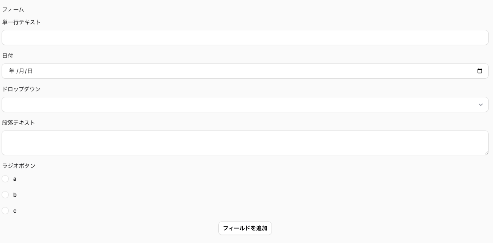
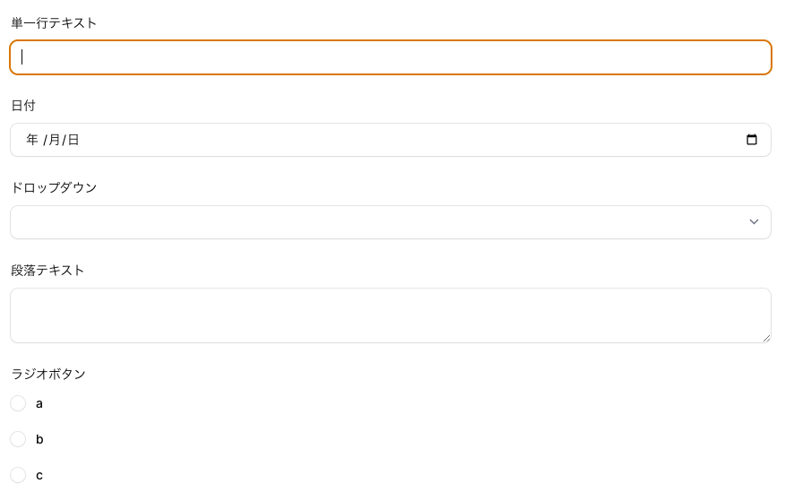

# green-flex-form

Copyright &copy; Kobesoft, Inc. All rights reserved.

## 概要

green-flex-formは、ユーザーが自由にフォームをデザインできるようにするためのプラグインです。

## インストール

```shell
npm install kobesoft/green-flex-form
```

## 使い方

### フォームのデザインツールの使い方

ユーザーにフォームのデザインを行わせたい場合は、以下のように定義します。

```php

    public static function form(Form $form): Form
    {
        return $form
            ->schema([
                // アンケートフォームデザイナー
                \Green\FlexForm\FlexFormDesigner::make('surveys')
                    ->label('フォーム')
                    ->columnSpanFull(),
            ]);
    }

```

例えば、下記のようなフォームをデザインすることができます。



この例だと、surveysフィールドに下記のような値が設定されます。

```php
[
    [
        'id' => '01JFVF94XB8H4J3ZD6DYYYZ7TS',
        'type' => 'text-input',
        'properties' => [
            'label' => '単一行テキスト',
        ],
    ],
    [
        'id' => '01JFVMEWRNE6MKMZN8H0NC4PNE',
        'type' => 'date-picker',
        'properties' => [
            'label'       => '日付',
            'description' => null,
            'placeholder' => null,
        ],
    ],
    [
        'id' => '01JFVJKCNHZZBQ2TZHS185WX7R',
        'type' => 'select',
        'properties' => [
            'label'       => 'ドロップダウン',
            'options'     => [
                '01JFVJKG4Y9421HJHKHYDPVA75' => 'test',
                '01JFVJKH0KBWEQ3J74EW90MBT5' => 'test',
                '01JFVJXQXQ1T42BD3M2X4ES5N7' => 'test2',
            ],
            'description' => null,
            'placeholder' => null,
        ],
    ],
    [
        'id' => '01JFVJNXY7C76GEZJHCEYY055Z',
        'type' => 'textarea',
        'properties' => [
            'label' => '段落テキスト',
        ],
    ],
    [
        'id' => '01JFVQQD275CY60MP2NK2Q3DGR',
        'type' => 'radio',
        'properties' => [
            'label'       => 'ラジオボタン',
            'options'     => [
                '01JFVQQH0BWC8PSCB5B7PR7PJV' => 'a',
                '01JFVQQHXP859MATNQ3ZS1HA0S' => 'b',
                '01JFVQQJQ1D3TV5FR78YJY7E5R' => 'c',
            ],
            'description' => null,
            'placeholder' => null,
        ],
    ],
];
```

### 入力フォームの使い方

ユーザーが定義したフォームを表示し、入力を受け付ける場合は、以下のように定義します。

```php
    // アンケートフォーム
    FlexForm::make('answers')
        ->flexForm(fn($record) => $record->surveys),
```

例えば、下記のようなフォームが表示されます。



この例だと、answersフィールドに下記のような値が設定されます。

```php
[
  "answers" => [
    "01JFVF94XB8H4J3ZD6DYYYZ7TS" => [
      "value" => "てすと"
    ],
    "01JFVMEWRNE6MKMZN8H0NC4PNE" => [
      "value" => "2024-10-10"
    ],
    "01JFVJKCNHZZBQ2TZHS185WX7R" => [
      "value" => "01JFVJKG4Y9421HJHKHYDPVA75"
    ],
    "01JFVJNXY7C76GEZJHCEYY055Z" => [
      "value" => "段落\n段落"
    ],
    "01JFVQQD275CY60MP2NK2Q3DGR" => [
      "value" => "01JFVQQH0BWC8PSCB5B7PR7PJV"
    ]
  ]
]
```

JSON形式で送信されるため、データベースに保存する場合は、JSONを使用して保存してください。

## ライセンス

MIT License
